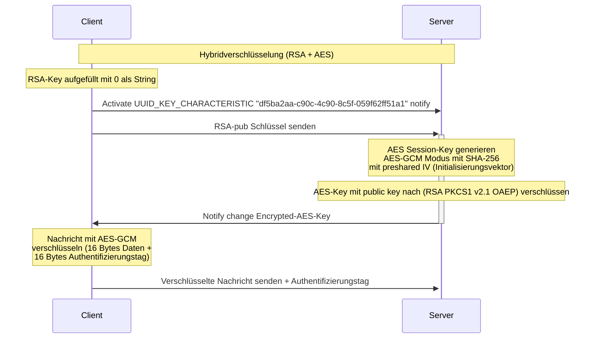

# ESP-Doorlock

Hier ist der Sachverhalt aus dem handschriftlichen Diagramm digital und strukturiert dargestellt:

---

### 🔐 **Hybrid-Verschlüsselung mit RSA und AES**

#### **Ablaufdiagramm**



---

### ✳️ Details zur Implementierung

#### **RSA**

- **Modus**: `RSA PKCS#1 v2.1 (OAEP)`
- **Hash-Funktion**: `SHA-256`
- **Hinweis**: **NICHT** `v1.5` verwenden → **Bleichenbacher-Angriff** möglich

#### **AES**

- **Modus**: `AES-GCM`
- **IV (Initialisierungsvektor)**:

  - Wird **einmalig zufällig** generiert und dokumentiert

- **Tag (Authentifizierungs-Tag)**:

  - Wird **mit dem verschlüsselten Text** übergeben
  - Format: `16 Byte verschlüsselte Daten + 16 Byte Tag`

```c++
uint8_t m_aes_iv[12] = {0x46, 0x61, 0x63, 0x68, 0x73, 0x63,
                        0x68, 0x61, 0x66, 0x74, 0x45, 0x54};
```

---

Möchtest du daraus auch eine Grafik im Stil eines Blockdiagramms, z. B. als SVG oder PNG?
