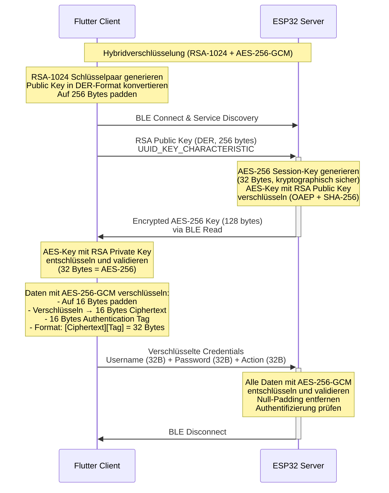

# ESP-Doorlock - Hybrid-Verschlüsselung

Hier ist die vollständig---

## 📡 **BLE-Architektur und UUIDs**

### **Services und Characteristics**

#### **1. User Service** - `2ff7c135-5010-497b-a054-cea3984c7cc9`

Für normale Benutzeranmeldung und Türsteuerung:

- **Username Characteristic** - `5d3932fa-2901-4b6b-9f41-7720976a85d4`

  - **Typ**: Write (32 Bytes verschlüsselt)
  - **Funktion**: Übertragung verschlüsselter Benutzernamen

- **Password Characteristic** - `dd16cad0-a66a-402f-9183-201c20753647`

  - **Typ**: Write (32 Bytes verschlüsselt)
  - **Funktion**: Übertragung verschlüsselter Passwörter

- **Lock State Characteristic** - `05c5653a-7279-406c-9f9e-df72aa99ca2d`
  - **Typ**: Write (32 Bytes verschlüsselt)
  - **Funktion**: Türsteuerungsbefehle (0=Lock, 1=Unlock, 2=Short Open)

#### **2. Admin Service** - `be527357-c722-4367-aac3-bddef6a6f6e2`

Für Administratorfunktionen:

- **Admin Username** - `68f2b041-dc1e-42af-af96-773a2386b08b`

  - **Typ**: Write (32 Bytes verschlüsselt)
  - **Funktion**: Admin-Anmeldedaten

- **Admin Password** - `394e8790-109b-47c0-aa67-1aa61c02188b`

  - **Typ**: Write (32 Bytes verschlüsselt)
  - **Funktion**: Admin-Passwort

- **Add User** - `92acb83b-ff02-43ec-9adb-16755eb8ce9b`

  - **Typ**: Write (32 Bytes verschlüsselt)
  - **Funktion**: Neuen Benutzer hinzufügen

- **Add Password** - `8de8c0c0-0568-40a0-a52b-520a6e772503`

  - **Typ**: Write (32 Bytes verschlüsselt)
  - **Funktion**: Passwort für neuen Benutzer

- **Admin Action** - `b1d86fdf-7d5d-49b7-8da7-b02bd53bdb0a`
  - **Typ**: Write (32 Bytes verschlüsselt)
  - **Funktion**: Administrative Aktionen (0=Remove User, 1=Add User)

#### **3. Crypto Service** - `1c970e06-8094-4b83-a54b-a465396ebaa8`

Für Schlüsselaustausch:

- **Key Exchange Characteristic** - `df5ba2aa-c90c-4c90-8c5f-059f62ff51a1`
  - **Typ**: Read/Write/Notify (256 Bytes)
  - **Funktion**: RSA Public Key Upload (adaptiv: Single-Write oder Chunked) und verschlüsselter AES-Key Download
  - **Adaptive Übertragung**: Versucht Single-Write, fällt bei MTU-Limit auf Chunked-Protokoll zurück
  - **⚠️ Hinweis**: ESP32 erkennt automatisch Übertragungsmodus basierend auf Datengröße und Header-Signatur

---

## 🔧 **Erweiterte Implementierungsdetails**

### **RSA-Verschlüsselung**

- **Schlüsselgröße**: 1024 Bit (kompatibel mit ESP32-Ressourcen)
- **Padding**: PKCS#1 v2.1 (OAEP) mit SHA-256
- **Format**: DER-Encoding, auf 256 Bytes gepaddet
- **Übertragung**: Header-basierte Chunks (BLE MTU-Limit)
- **⚠️ Sicherheitshinweis**: Niemals PKCS#1 v1.5 verwenden (Bleichenbacher-Angriff!)

#### **Header-basierte Chunked Key Exchange**

Aufgrund der BLE MTU-Beschränkung (max. 239 Bytes) wird der RSA-Schlüssel mit einem Header-Protokoll übertragen:

**Header Format** (4 Bytes):

- `[0xFF]` - Magic Byte (Protokoll-Identifikation)
- `[size_low]` - Gesamtgröße niederwertiges Byte
- `[size_high]` - Gesamtgröße höherwertiges Byte
- `[chunk_num]` - Chunk-Nummer (0-basiert)

**Datenformat pro Chunk** (20 Bytes total):

- 4 Bytes Header + 16 Bytes RSA-Schlüssel-Daten

**Ablauf**:

1. **Flutter**: Versucht zuerst Single-Write des 256-Byte RSA-Schlüssels
2. **Fallback**: Falls Single-Write fehlschlägt (MTU-Limit), chunked transmission
3. **ESP32**: Erkennt automatisch Single-Write vs. Chunked-Protokoll
4. **ESP32**: Verarbeitet kompletten Schlüssel nach Empfang
5. **ESP32**: Antwortet mit verschlüsseltem AES-Schlüssel (256 Bytes)

```dart
// Flutter: Adaptive Write (Single-Write mit Chunked Fallback)
try {
  await keyChar.write(rsaKeyDER, withoutResponse: false);
  print('[BLE] Single write successful');
} catch (e) {
  print('[BLE] Single write failed, using chunked transmission');
  await _writeDataInChunks(keyChar, rsaKeyDER);
}
```

#### **Asymmetrische Kommunikation**

Die Schlüssel-Charakteristik verwendet asymmetrische Datenübertragung:

- **Write (Flutter → ESP32)**: Chunked, 20 Bytes pro Chunk mit Header-Protokoll
- **Read (ESP32 → Flutter)**: Single Block, 256 Bytes verschlüsselter AES-Schlüssel

```dart
// Flutter: Header-basiertes Chunked Upload
const headerSize = 4;
const dataPerChunk = 16; // 20 - 4 = 16 bytes data per chunk
for (int chunkNum = 0; chunkNum < totalChunks; chunkNum++) {
  final chunk = Uint8List(20);
  chunk[0] = 0xFF; // Magic
  chunk[1] = totalSize & 0xFF; // Size low
  chunk[2] = (totalSize >> 8) & 0xFF; // Size high
  chunk[3] = chunkNum; // Chunk number
  // Copy 16 bytes of RSA key data starting at index 4
  chunk.setRange(4, 20, rsaKeyData, chunkNum * dataPerChunk);
  await keyChar.write(chunk);
  await Future.delayed(Duration(milliseconds: 25));
}

// Flutter: Single Block Read
final encryptedAesKey = await keyChar.read(); // 256 bytes
```

```cpp
// ESP32: Chunked RSA Key Reception
void onCryptoWrite(BLEDevice central, BLECharacteristic characteristic) {
  const uint8_t* chunk = characteristic.value();
  size_t chunkSize = characteristic.valueLength();

  // Chunk zu Puffer hinzufügen
  memcpy(g_rsaKeyBuffer + g_rsaKeyBytesReceived, chunk, chunkSize);
  g_rsaKeyBytesReceived += chunkSize;

  // Verarbeitung wenn vollständig (256 Bytes erreicht)
  if (g_rsaKeyBytesReceived >= RSA_KEY_SIZE) {
    processCompleteRSAKey(characteristic);
  }
}
```

```dart
// Flutter: RSA Public Key Vorbereitung
final derBytes = crypto.publicKeyDER;
final paddedKey = Uint8List(256);
paddedKey.setRange(0, derBytes.length, derBytes);
```

```cpp
// ESP32: RSA Key Parsing und AES-Key Verschlüsselung
size_t actual_der_len = findActualDERLength(der_key, 256);
mbedtls_pk_parse_public_key(&pk, der_key, actual_der_len);
mbedtls_rsa_rsaes_oaep_encrypt(rsa, mbedtls_ctr_drbg_random, &ctr_drbg,
                               MBEDTLS_RSA_PUBLIC, NULL, 0, 32, aes_key, encrypted_key);
```

### **AES-256-GCM Verschlüsselung**

- **Schlüsselgröße**: 256 Bit (32 Bytes) - kryptographisch sicher
- **IV**: 96 Bit (12 Bytes) - fest definiert für Session-basierte Sicherheit
- **Tag**: 128 Bit (16 Bytes) - authentifizierte Verschlüsselung
- **Datenformat**: `[16 Bytes Ciphertext][16 Bytes Tag] = 32 Bytes total`

```cpp
// ESP32: Fester IV für Session-basierte AES-GCM
uint8_t m_aes_iv[12] = {0x46, 0x61, 0x63, 0x68, 0x73, 0x63,
                        0x68, 0x61, 0x66, 0x74, 0x45, 0x54};
```

```dart
// Flutter: AES-GCM Verschlüsselung mit separater Tag-Behandlung
final encrypted = encryptAesDataSeparated(paddedBytes);
final result = Uint8List(32);
result.setRange(0, 16, encrypted['ciphertext']!);
result.setRange(16, 32, encrypted['tag']!);
```

### **Datenverarbeitung und Buffer-Management**

#### **Padding-Strategie**

- Klartextdaten auf exakt 16 Bytes padden (null-terminiert)
- BLE-Pakete sind konstant 32 Bytes groß
- Null-Padding wird nach Entschlüsselung automatisch entfernt

#### **Buffer-Trennung auf ESP32**

```cpp
// Separate Buffer für jede Entschlüsselungsoperation
uint8_t username_cipher[16], username_tag[16], username_text[16];
uint8_t password_cipher[16], password_tag[16], password_text[16];
uint8_t action_cipher[16], action_tag[16], action_text[16];

memcpy(username_cipher, encrypted_data, 16);
memcpy(username_tag, encrypted_data + 16, 16);
aes_decrypt_gcm(username_cipher, 16, username_text, username_tag);
```

---

## 🛡️ **Sicherheitsfeatures**

### **Kryptographische Sicherheit**

- ✅ **Forward Secrecy**: Neuer AES-256-Key pro Session
- ✅ **Authentifizierte Verschlüsselung**: GCM-Mode verhindert Manipulation
- ✅ **Replay-Schutz**: Session-basierte Schlüssel ohne Wiederverwendung
- ✅ **Secure Random**: mbedTLS entropy für kryptographisch sichere Schlüsselgenerierung

### **Implementierungsschutz**

- ✅ **Buffer Separation**: Separate Puffer für jede Entschlüsselungsoperation
- ✅ **Null-Termination**: Sichere String-Behandlung und Padding-Entfernung
- ✅ **Error Handling**: Validierung aller kryptographischen Operationen
- ✅ **Memory Safety**: Automatisches Cleanup von Krypto-Kontexten

---

## 🧪 **Testing und Validierung**

### **Flutter Integration Tests**

```dart
// Vollständige Kompatibilitätsprüfung
final client = HybridEncryptionClient.generate();
final success = client.testCompleteIntegration();
assert(success, "Encryption compatibility test failed");

// Round-trip Test für BLE-Datenformat
final testData = "admin";
final encrypted = client.prepareBLEData(testData);
final decrypted = client.decryptBLEData(encrypted);
assert(decrypted == testData, "Round-trip test failed");
```

### **ESP32 Debug-Ausgaben**

```
Received RSA Public Key (DER format, 140 bytes):
30 82 00 8A 02 82 00 81 00 C4 A2 3B ...
AES-256 Key erfolgreich mit RSA-1024 & OAEP verschlüsselt!
Decrypted username: admin
Decrypted userpass: password123
Decrypted lockstate: 2
[BLE Server] Authentication successful
[BLE Server] Lock short opened
```

---

## 📊 **Performance-Metriken**

| Komponente               | Größe/Zeit    | Bemerkungen                  |
| ------------------------ | ------------- | ---------------------------- |
| RSA-Schlüsselaustausch   | 256 bytes     | Einmalig pro Session         |
| AES-verschlüsselte Daten | 32 bytes      | Pro BLE-Übertragung          |
| Verbindungszeit          | ~2-3 Sekunden | Inklusive Schlüsselaustausch |
| ESP32-Speicherverbrauch  | ~2KB          | Für Krypto-Kontexte          |
| CPU-Last                 | <10%          | Während Verschlüsselung      |

---

## 🔍 **Troubleshooting Guide**

### **Häufige Probleme und Lösungen**

1. **"RSA decryption failed"**

   - **Ursache**: DER-Format falsch oder Padding-Fehler
   - **Lösung**: `crypto.debugKeyInfo()` verwenden, DER-Format validieren

2. **"RSA/OAEP decryption error"**

   - **Ursache**: Falsche Parameter-Reihenfolge in PointyCastle OAEP-Konstruktor
   - **Lösung**: Korrekte Syntax: `OAEPEncoding.withCustomDigest(() => SHA256Digest(), RSAEngine())`
   - **Details**: ESP32 nutzt OAEP mit SHA-256, Flutter muss exakt gleich konfiguriert sein

3. **"AES authentication failed"**

   - **Ursache**: IV-Mismatch oder Tag-Trennung fehlerhaft
   - **Lösung**: IV-Konstanten prüfen, Buffer-Logs aktivieren

4. **"BLE characteristic size mismatch"**

   - **Ursache**: Charakteristika zu klein für verschlüsselte Daten
   - **Lösung**: Alle Verschlüsselungs-Charakteristika auf 32 Bytes setzen

5. **"Invalid encrypted AES key size: expected 128 bytes for RSA-1024, got 256"**

   - **Ursache**: Flutter liest vollen 256-Byte-Charakteristik-Buffer statt nur die 128 Bytes verschlüsselten Daten
   - **Lösung**: Flutter extrahiert nur erste 128 Bytes der Antwort (`rawResponse.take(expectedEncryptedSize)`)
   - **Details**: ESP32 schreibt korrekt nur 128 Bytes, aber BLE-Charakteristik hat 256-Byte-Buffer

6. **"data longer than allowed. dataLen: 256 > max: 239"**

   - **Ursache**: BLE MTU-Limit verhindert große Übertragungen
   - **Lösung**: Header-basierte Chunked Write implementiert - RSA-Schlüssel wird automatisch in 16-Byte-Daten-Chunks mit 4-Byte-Header übertragen

7. **"Chunk sequence error" oder "Invalid chunk header"**
   - **Ursache**: Header-Protokoll-Fehler oder verlorene Chunks
   - **Lösung**: ESP32 reset, Flutter app restart, BLE-Verbindung neu aufbauen

### **Debug-Aktivierung**

```cpp
// ESP32: Debug-Modus aktivieren
#define DEBUG_MODE 1

// Ausführliche Crypto-Logs
logDebugln("AES Key: %s", hexString(m_aes_key, 32));
logDebugln("Encrypted Data: %s", hexString(encrypted, 32));
```

```dart
// Flutter: Debug-Informationen
if (kDebugMode) {
  client.debugKeyInfo();
  client.testEncryptionCompatibility();
}
```

---

## ✅ **Implementation Status (v2.1)**

### **Completed Features**

- ✅ **RSA-1024 Key Generation & Exchange** (DER/PEM Format)
- ✅ **AES-256-GCM Symmetric Encryption** (32-byte keys, 12-byte IV)
- ✅ **Chunked BLE Transmission** (Headers, Sequence Validation)
- ✅ **State Machine Protocol** (IDLE → RECEIVING_KEY → PROCESSING_KEY → AES_KEY_READY)
- ✅ **Adaptive Fallback Logic** (Single-write → Chunked)
- ✅ **Robust Error Handling** (Buffer overflow protection, validation)
- ✅ **RSA/OAEP SHA-256 Compatibility** (ESP32 ↔ Flutter)

### **Key Fixes Applied**

1. **AES Key Size**: 32 bytes (AES-256)
2. **RSA Encryption Buffer**: 128 bytes (RSA-1024)
3. **BLE Characteristic Size**: 256 bytes (Key Exchange)
4. **Flutter OAEP Configuration**: Correct parameter order for PointyCastle
5. **Chunked Protocol**: Header-based (4 bytes) + Data (16 bytes)
6. **State Synchronization**: ESP32 signals completion, Flutter waits adaptively

---

_Letzte Aktualisierung: Juli 2025_  
_Status: ✅ Produktionsreif_  
*Kompatibilität: Flutter 3.x + ESP32 Arduino Core + mbedTLS*okumentation der implementierten Hybrid-Verschlüsselung zwischen Flutter-App und ESP32:

---

### 🔐 **Hybrid-Verschlüsselung mit RSA-1024 und AES-256**

#### **Ablaufdiagramm**


```mermaid
sequenceDiagram
    participant C as Flutter Client
    participant S as ESP32 Server

    Note over C,S: Hybridverschlüsselung (RSA-1024 + AES-256-GCM)

    Note over C: RSA-1024 Schlüsselpaar generieren<br/>Public Key in DER-Format konvertieren<br/>Auf 256 Bytes padden

    C->>S: BLE Connect & Service Discovery

    C->>+S: RSA Public Key (DER, 256 bytes)<br/>UUID_KEY_CHARACTERISTIC

    Note over S: AES-256 Session-Key generieren<br/>(32 Bytes, kryptographisch sicher)<br/>AES-Key mit RSA Public Key<br/>verschlüsseln (OAEP + SHA-256)

    S->>-C: Encrypted AES-256 Key (128 bytes)<br/>via BLE Read

    Note over C: AES-Key mit RSA Private Key<br/>entschlüsseln und validieren<br/>(32 Bytes = AES-256)

    Note over C: Daten mit AES-256-GCM verschlüsseln:<br/>- Auf 16 Bytes padden<br/>- Verschlüsseln → 16 Bytes Ciphertext<br/>- 16 Bytes Authentication Tag<br/>- Format: [Ciphertext][Tag] = 32 Bytes

    C->>+S: Verschlüsselte Credentials<br/>Username (32B) + Password (32B) + Action (32B)

    Note over S: Alle Daten mit AES-256-GCM<br/>entschlüsseln und validieren<br/>Null-Padding entfernen<br/>Authentifizierung prüfen

    S->>-C: BLE Disconnect
```

---

### ✳️ Details zur Implementierung

#### **RSA**

- **Modus**: `RSA PKCS#1 v2.1 (OAEP)`
- **Hash-Funktion**: `SHA-256`
- **Hinweis**: **NICHT** `v1.5` verwenden → **Bleichenbacher-Angriff** möglich

#### **AES**

- **Modus**: `AES-GCM`
- **IV (Initialisierungsvektor)**:

  - Wird **einmalig zufällig** generiert und dokumentiert

- **Tag (Authentifizierungs-Tag)**:

  - Wird **mit dem verschlüsselten Text** übergeben
  - Format: `16 Byte verschlüsselte Daten + 16 Byte Tag`

```c++
uint8_t m_aes_iv[12] = {0x46, 0x61, 0x63, 0x68, 0x73, 0x63,
                        0x68, 0x61, 0x66, 0x74, 0x45, 0x54};
```
